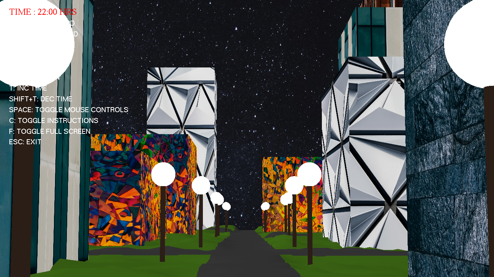
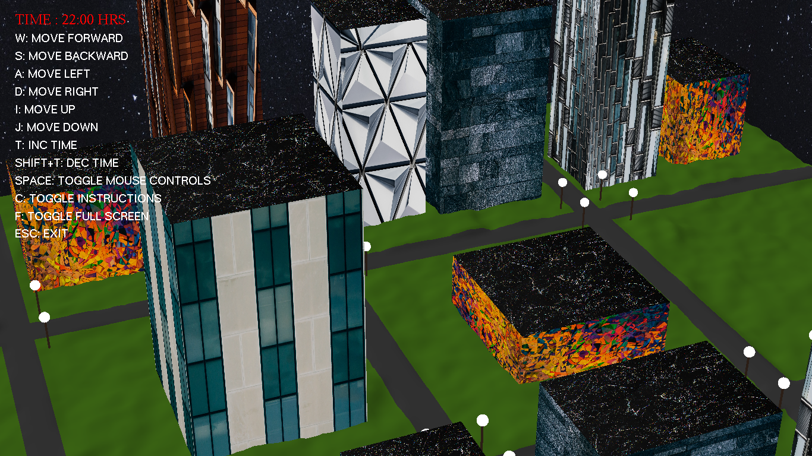
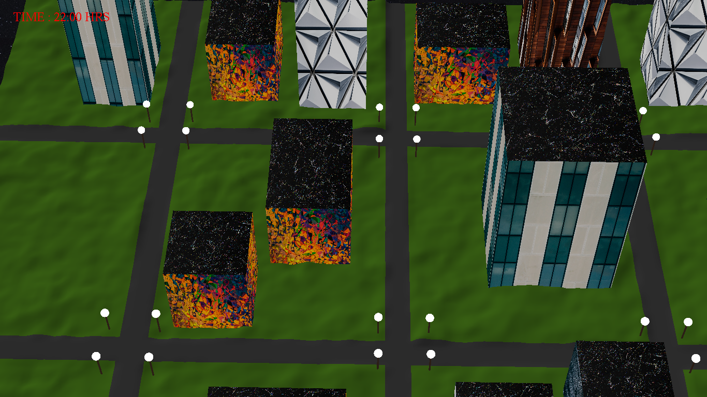
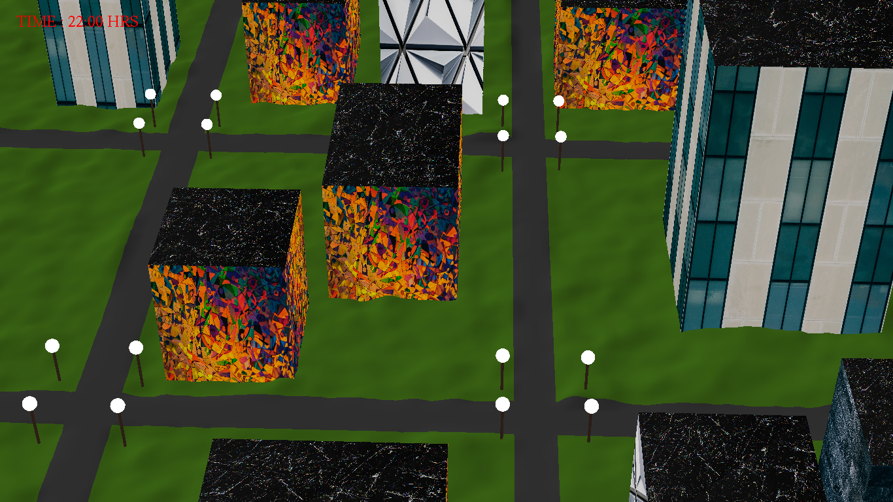

# 3d-map-simulator

### Instructions to run :

```shell
make run
```

### Technologies used :

* Glut (OpenGL)
* Textures

### Features :

* Terrains
* Textures
* Skybox
* Buildings (different size and texture) and lamps
* Time of the day :
  * Sky
  * Lamps On off and Glass effect
* Full camera control with mouse and keyboard.
* Text rendering (Instructions and time)
* Collision avoidance

### Screenshots




